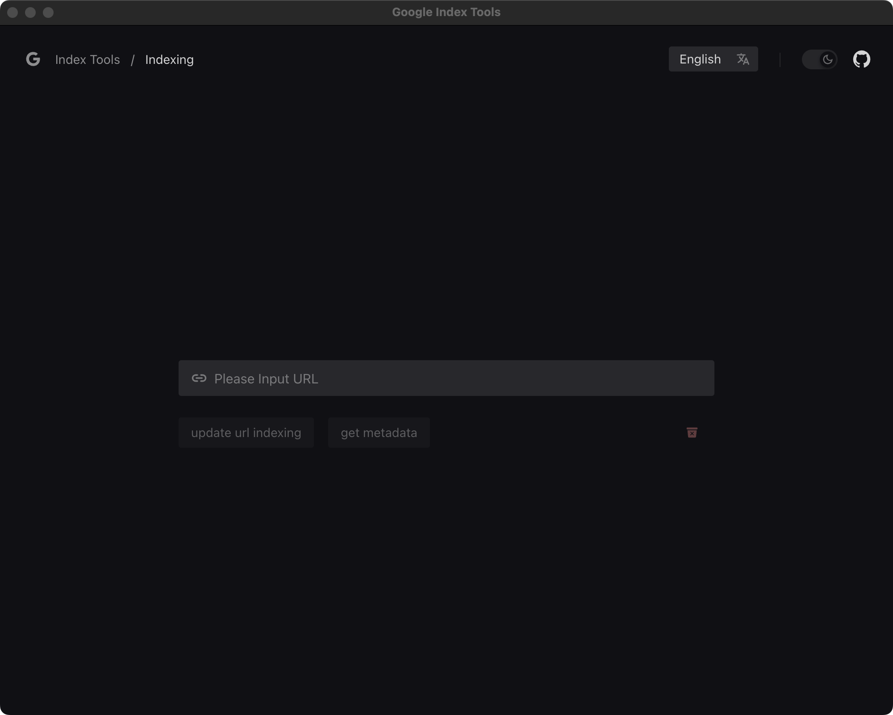
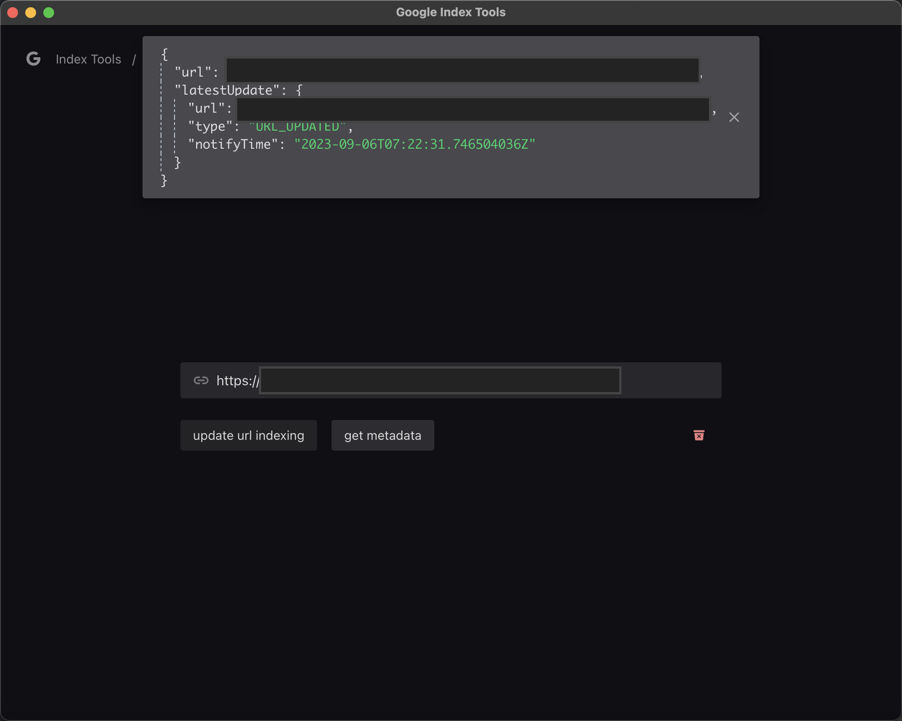

# google-index-tools

Build with `Electron`, simple Application for Google indexing-api usage.

[https://developers.google.com/search/apis/indexing-api/v3/using-api](https://developers.google.com/search/apis/indexing-api/v3/using-api)

### Road Map

- [x] Mac release
- [ ] Windows release
- [ ] i18n

### Screenshots

### Apply `Privacy & Security` setting

### Why electron?

> Node.js client library for using Google APIs. Support for authorization and authentication with OAuth 2.0, API Keys and JWT tokens is included.

[googleapis](https://www.npmjs.com/package/googleapis) is a NodeJs runtime package, we can not use in browser. Technically, this application can be de delivered into a web page, but the same time, I must deliver a NodeJs server bewteen browser and google. It seems make thing complicated.
